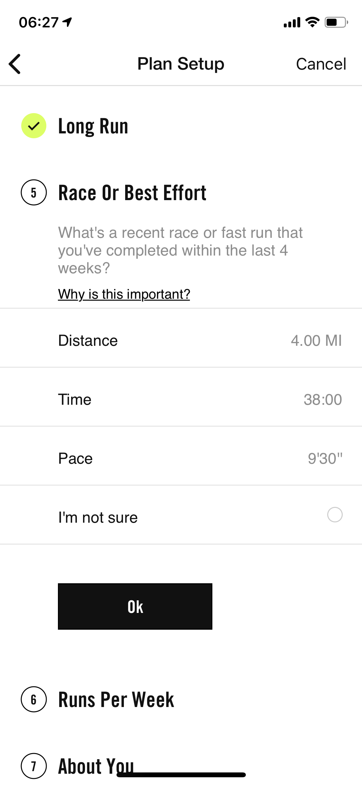
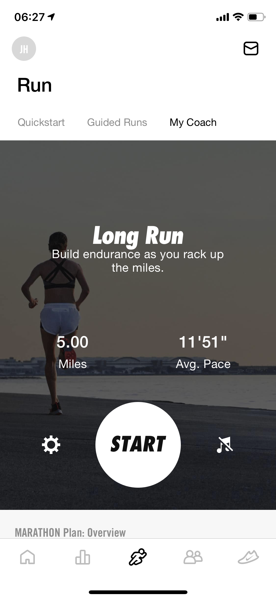

Day | Mileage | Target Pace | Actual Pace
------------ | ------------- | ------------- | -------------
Saturday, May 30, 2020 | 5 | 11'51" |
Sunday, May 31, 2020 | rest | 

When I signed up for the in-person Chicago Endurance Sports 2020 Chicago Marathon training, I listed "Fun" as the primary reason for running the marathon. The camaraderie of running at York High School was what I had wanted to return to. In fact, the person who recommended Lurie's marathon team ran with me in high school. The goal of this is to try to replicate that -- or at least document it probably not working. Amid the pandemic, this is not ideal times. 

Sometimes I feel like we're just caveman crouching in our caves, not sure what we're afraid of. While that may be by benign neglect (at least in US), I did not expect the crisis to affect an event in October. There has been an incredible effort on the internet from our homes to try to make this slightly better. One [story by developers](https://www.youtube.com/watch?v=ryngYoHXNfQ) really inspired me that there's small "unglamorous" things we can do to make this better. 

Running is that for me. 

The team at CES seems like it's collecting data to try to make this better. However, I think there's free resources that we can use. That's why I'm trying a plan from [Nike Run Club](https://www.nike.com/nrc-app). I know my wife likes Strava and the community there. May change at some point ... open to recommendations.

Alright, I haven't ran for a while. So I listed my last good run in recent weeks. 

Due to the pandemic, it's made me anxious to run in crowds sometimes nearby in the Belmont Harbor trail. Nevertheless, there are good safety options like I've seen on Chicago Area Runner's Association.

Let's see if I can overcome some of the cobwebs with a 5-mile intro run proposed by Nike plan. I'll be listing mileage and target pace in some programmatic way in the future (this is a writing and hopefully data project). In the meantime, here is the goal for today. 

