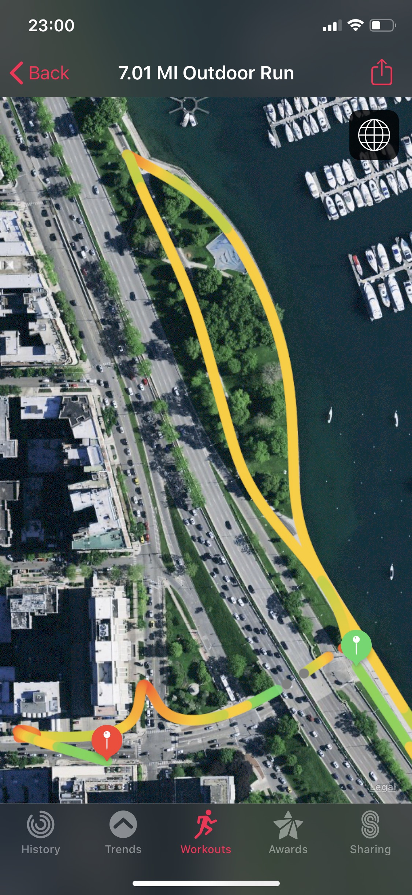

A couple 800m runs made this week's training really fun. I biked 2 miles to the track using my old bike. It felt really fun to stay within the lane and see other runners whizzing by. And it was a relief no one yelling times or that formal pressure. Kind of the best of both worlds, plus a view of the lake.

Also, the energy gummies were fun to try out on the track day -- though it may have been unnecessary.

| Day | Distance            | Pace  |
| --- | ------------------- | ----- |
| M   | 3.75 mi             | 9'18" |
| T   | 2x800m              | 7'13" |
| W   | rest                |       |
| Th  | 1.58 mi (benchmark) | 9'58" |
| F   | rest                |       |
| Sa  | cross-training      |       |
| Su  | 7 mi                | 9'51" |

## Long Run Sunday

It felt good to have more mileage at an average pace (just above my target 9'45"). After a heavy night, it was a good wakeup as well. I've been beat all day but it feels like I've accomplished something today. Again, giving purpose to closings.

It continues to be chaos on the trails. More half-downed fences and bottlenecks with slow and fast runners and bikers alike. There's also been mass erosion on the trail. Going south, there are sidewalk tiles out of place like there's been an earthquake. The rubble reminded me of results of earthquakes in Christchurch, New Zealand.

Like Nike's coach Bennet said, we won't be able to run our best races, but we can try. Do our best; focus on what we can control.

For example, I started running in the grass amid the crowded and underwater trail running just north of Belmont Harbor. Near the end of my run on Sunday, I partially twisted my ankle. I don't think it's awful but it wasn't fun, slowing me down. Preferring the water to the crowded lane and the stick-filled grass, my feet got soaked by the 4 inch standing water. My run on the way back on the more inland bike lane was sloshy.

I learned anew that wet socks are no fun, especially thick cotton ones. In response, I've made running a priority in the budget and bought Balega socks I've tried before.

I'm a bit sore and more exhausted after the 7 miles than I was hoping. I think recovery is key to maintaining the long training schedule. I've iced my knee once -- and doing so again now.

## Healthy Habits Hopefully Paying Off

| Day | Dynamic Stretching (2x) | Foam Roll | Hip Strengthening |
| --- | ----------------------- | --------- | ----------------- |
| M   | ✅                      | ✅        | ✅                |
| T   | ✅                      | ✅        | ✅                |
| W   | ✅                      | ❌        | ✅                |
| Th  | ✅                      | ✅        | ✅                |
| F   | ✅                      | ❌        | ✅                |
| Sa  | ✅                      | ✅        | ✅                |
| Su  | ✅                      | ✅        | ✅                |

On Wednesday, I just knw I could get out of bed and foam roll. But that maybe it wouldn't be 100 percent effort. Then, on Friday, I was at the parents' house without a foam roller. That's my excuses. The hip strengthening, especially with NTC core cross-training, feels effective. Still felt some pain in my left knee's hamstring on Sunday.

Will look into adding some new exercises recommended by a friend who has done the New York Marathon. Will update on that.
