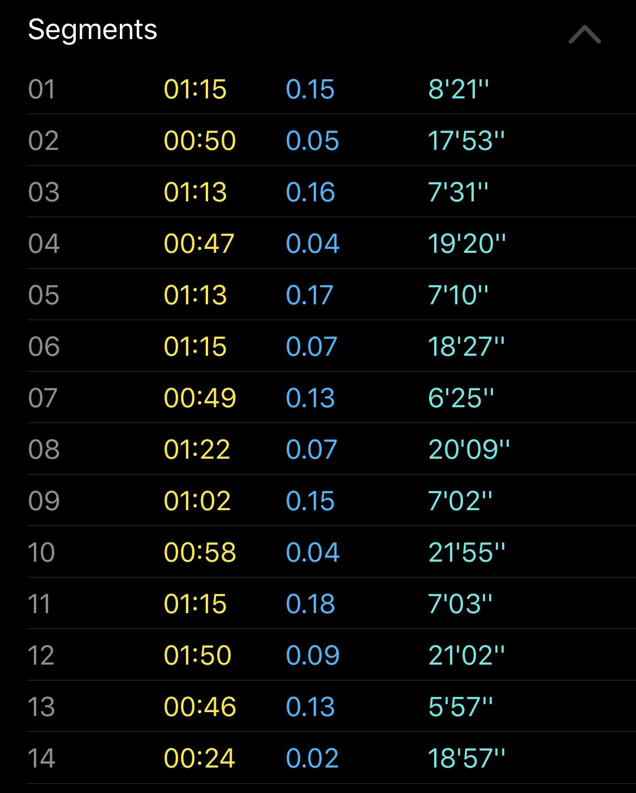

| Day       | Distance              | Target Pace | Actual Pace |
| --------- | --------------------- | ----------- | ----------- |
| 6/15/2020 | 3.25mi                | 9'30"       | 9'11"       |
| 6/16/2020 | rest                  |             |
| 6/17/2020 | 2x800m                | 8'00"       | 7'52"       |
| 6/18/2020 | 7x200m                | \*          | ~7'30"      |
| 6/19/2020 | cross-training (bike) |             |
| 6/20/2020 | 6.5 mi                | 10'01"      | 9'45"       |
| 6/21/2020 | cross-training (core) |             |

The sprint days were fun! Really enjoyed one segment near the middle on Thursday that was 5'57" mile pace. On my 11th segment (including rest ones, perhaps wrongly):

This week, I explored segments with the native workout app on Apple Watch rather than Nike Run Club's app. Tried to have the 45-second breaks included correctly there. Probably should just record the runs, then pause.Anyway, it was fun to go fast.

While talking with other friends about the app and the plans, I'm hesitant to emphasize the speed training amid marathon training. While the distance is the hardest part (not the pace), I've always found the ability and feel of speed to be helpful for stride and confidence. For instance, during the last few miles of the long run, I focused on running hard between light poles in order to keep my pace up.

This is similar to the fartlek idea of running hard in short bursts. I remember in high school running this was so you didn't settle into a slower pace: you tried to fight yourself out of it with small bursts. Essentially, run hard in between light poles that are typically like 100 m.

## Stretching Went Ok, Rolling and Strengthening Not

| Day       | Dynamic Stretching (2x) | Foam Roll | Hip Strengthening |
| --------- | ----------------------- | --------- | ----------------- |
| 6/15/2020 | ✅                      | ✅        | ✅                |
| 6/16/2020 | ✅                      | ✅        | ✅                |
| 6/17/2020 | ❌                      | ✅        | ✅                |
| 6/18/2020 | ❌                      | ❌        | ❌                |
| 6/19/2020 | ❌                      | ❌        | ❌                |
| 6/20/2020 | ❌                      | ❌        | ❌                |
| 6/21/2020 | ✅                      | ✅        | ✅                |

I think the pressure to get two stretches affected the goal here. When I couldn't get that easy win, I think I was less likely to foam roll. That felt amazing on Sunday after the long run.

Hip strengthening I could really feel in my yoga workout on Sunday (world yoga day heh). Downward dog felt less challenging than normal; haven't done yoga in a while so it was a good control.

I felt some pain while doing core and hip cross-training on Sunday after some aggressive jumping jacks. Will monitor how that feels in the cross-training workouts impact. But overall I think my hips feel stronger which is leading to less pain running.

I did feel like my legs lost some strength near the end of the long run on Saturday. Although, from a hydration perspective, I think that may have been more at fault. Will look into maybe hydration or fueling while running.

## Mid-Week Struggle

I didn't keep up with stretching mid-week in a kind of lull. I think part of it was transitioning away from the still-buggy Nike Running Club. That habit of logging runs and waiting for it to sync may have been kind of a cue to do other things like stretch.

Will definitely lower the stretching goal back to 1x a day until foam rolling and hip strengthening is more consistent.

A bike cross-training workout was a massive help on Friday at our apartment's gym.

## Marathon Cancel: Will They Or Won't They?

It's hard to [read](https://www.chicagomarathon.com/runners/rules-safety/event-update/) from the marathon ["we can neither confirm nor deny"](https://en.wikipedia.org/wiki/Glomar_response) that it's happening:

> At this time, we are unable to say definitively whether or not the race will proceed and we want you to know that we are preparing for both outcomes.

My family is confident that we'll still be able to fundraise. But it's been hard getting the courage to ask people for donations if we can't tell them they won't be able to see their donations pictured like marathons are typically imagined. It's like, We want a wedding gift, but you can't come, or even see photos of the wedding. Part of the donation experience is shared experience with the fans (if they can come) or even our shared experience with other runners and fans.

I still want you to donate in the footer link below. Yet I'm not sure how exactly you can quantify your donation. Maybe that sounds cold but there's typically a social contract like for gift-giving. You're always sure Santa is going to come .... Sorry for the metaphors.

Anyway, I know the money will go to help pay for the children's medical treatment. How my running or lack thereof will be involved, no clue.

In any case, I like the schedule of running. The lakefront is gorgeous and I genuinely enjoy running outside healthy. I'm also cognizant of a Nike Run Club or maybe CARA point that running and exercise should be done in moderation as health facilities have been affected. Going 110%, as a result, should be cautioned. I think a more sustainable pace amid the madness and uncertainty is comforting. It's like, I spent so many years trying to go fast -- yet learned slower is key for long-term.

I've never validated this. But I remember the email template from one of my high school social studies teachers email footer:

> If you want to go fast, go alone. If you want to go far, go together.

I didn't believe it for the longest time, until late in college. Yet it's been right again and again. While it's not quite the tortoise and the hare, it means that support from others is the most important aspect of training: whether that's motivation from my wife on a Saturday morning; comforting from my parents about fundraising; my grandparents always being enthused about the marathon on the phone.
