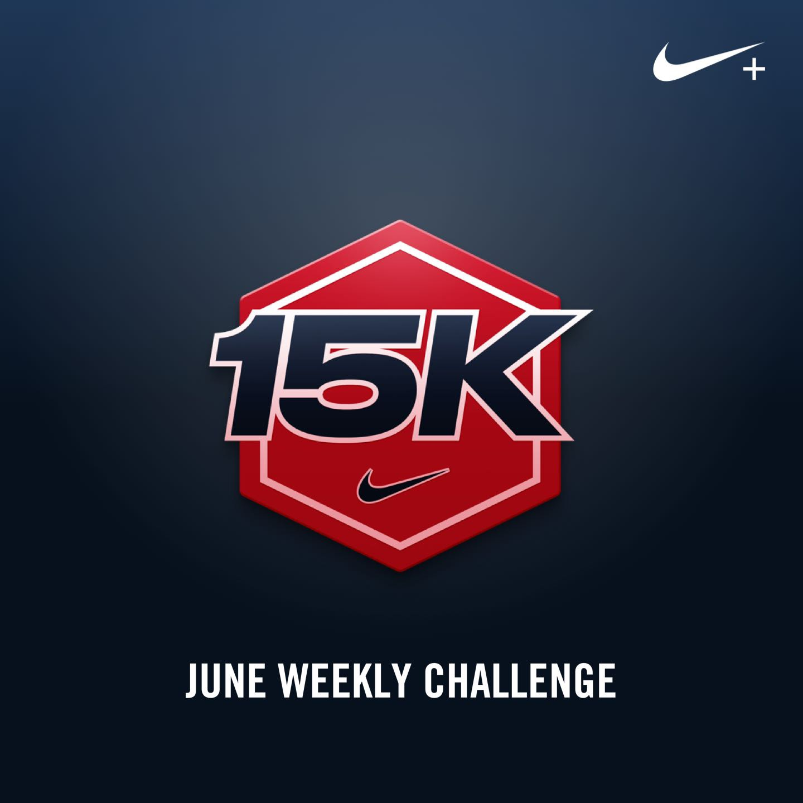
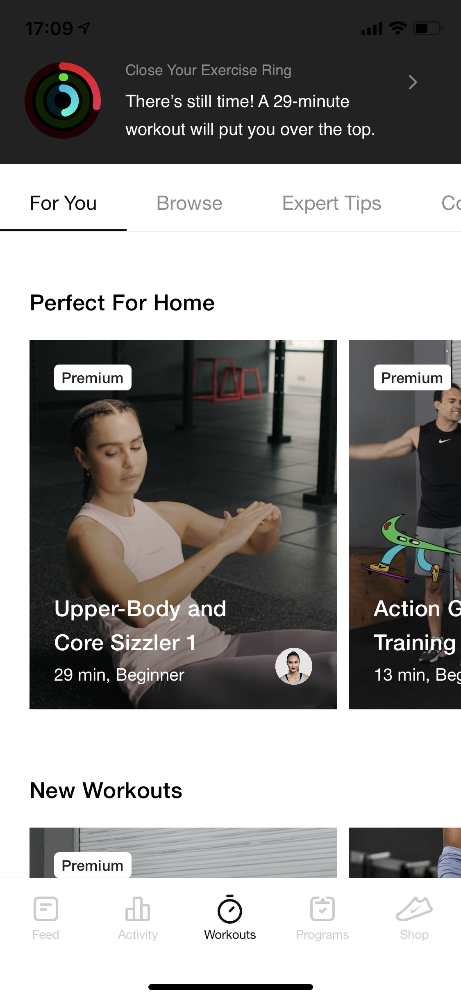
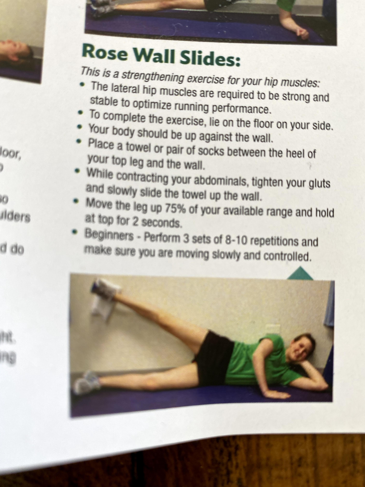

| Day      | Mileage        | Target Pace | Actual Pace |
| -------- | -------------- | ----------- | ----------- |
| 6/1/2020 | 2.75           | \*          | 8'57"       |
| 6/2/2020 | 5x400          | 9'57"       | 8'33"       |
| 6/3/2020 | rest           |             |             |
| 6/4/2020 | 7x200\*        | 9'28"       | 12'05"      |
| 6/5/2020 | cross-training |             |             |
| 6/6/2020 | 5.5            | 11'51"      | 9'42"       |
| 6/7/2020 | rest           |             |             |

On a fitness podcast, the guest [talked](https://overcast.fm/+WtY6rzYys) about how running and exercise is one thing that we can control. The Nike Run Club coach, Chris Bennett, described how we should focus on what we can do -- not what we can't. There are some caveats on how people can be prevented from running, due to health or persecution. Yet I want to say how grateful I am to run on the lakefront trail (partially opened) and within Belmont Harbor paths (open open).

Furthermore, taking control of little wins like [stretching and foam-rolling](https://run-log.netlify.app/hello-world), as well as hip-strengthening, have given the end of workday some purpose. Also I get to make another table:

| Day      | Dynamic Stretching | Foam Roll | Hip Strengthening |
| -------- | ------------------ | --------- | ----------------- |
| 6/1/2020 | ✅                 | ❌        | ❌                |
| 6/2/2020 | ✅                 | ❌        | ❌                |
| 6/3/2020 | ✅                 | ✅        | ✅                |
| 6/4/2020 | ✅                 | ❌        | ❌                |
| 6/5/2020 | ✅                 | ❌        | ❌                |
| 6/6/2020 | ✅                 | ✅        | ❌                |
| 6/7/2020 | ✅                 | ✅        | ✅                |

In the future, I want to use webhooks integration with Netlify functions and [Streaks](https://crunchybagel.com/streaks-5-now-available/). I think there's definitely something to be done here programmatically (Nike Run Club and Apple Health are a black box). Publishing this data, even though it's not widely shared, gives me accountability. I'm a big fan of the idea of "learning in public".

I did find that on my off-day, it was far easier to remember to foam roll and do leg-strengthening (duh, right). Hopefully next week will see fewer ❌s.

## Introvert Self Care

In the fitness show, Chris also described routines for self-care. He emphasized dancing (with his small child, cute) and laughing. A recent [episode of Diplo & Friends](https://www.bbc.co.uk/programmes/m000jp1p), on BBC, from Baauer really made me dance the other day. I didn't find a ton of times to truly laugh this week, but will try in the future.

Routines like this reminded me of an article [The Introverts’ and Extroverts’ Guide to Thriving in a Lockdown](https://www.bloomberg.com/news/articles/2020-06-01/do-introverts-or-extroverts-thrive-in-coronavirus-lockdown). Definitely as an introvert a fun routine is helpful. They went even further categorizing INTJs in the article.

## Small Win

Celebrating a small win (and cool graphic)

## Short Runs Sucked

I was surprised how hard it was to time breaks and distances for 200s and 400s. Guess I was spoiled with a track and timers in the past. Found a track on the trail and may use that in the future and bike to it. Hopefully that will be easier. As you can tell from my 200 day, the walking and break-taking and jogging between didn't really work (ran too far, hectic).

## Cross-Training Surprisingly Fun

It was cool how integrated Nike Training Club, Nike Running Club, and Apple Activity were. I guess when you own the whole stack you can do things like this.

Overall, the workout was a good length (around 20 minutes) and the right amount of stretching and strengthening. Apple's activity features have been helpful for getting me out of my desk the past few days. It's easy to fall into a trap of working a lot (see badgering to workout below).

Was tempted this week by some of the Lurie Children's Strava group features. That social aspect may be helpful. But, in the meantime, I'm liking the native integration with Nike and Apple -- feel like such a tech bro heh. (Also my partner is getting an Apple Watch so we're going even deeper down that Apple fandom.)

Here are some of the strengthening as well:

Also my favorite workout from high school ... writing the alphabet standing on one leg with the other. I felt a similar burn in my upper thighs/hips doing it and kinda enjoy it (will try to find a link).
