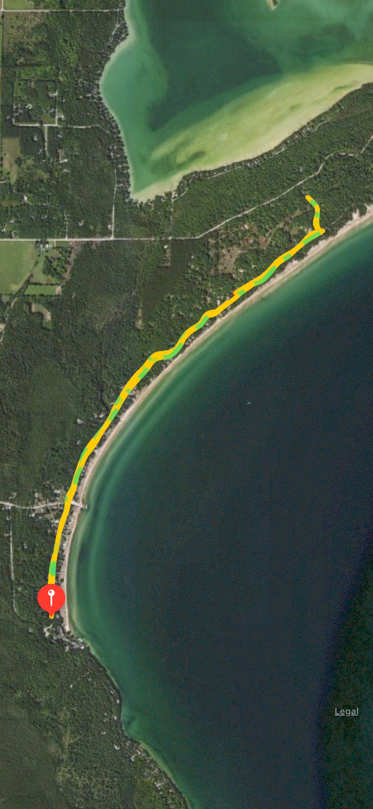

These are some of my initial reactions to the [cancellation](https://www.chicagomarathon.com/runners/rules-safety/event-update/) initially after reading it:

- Some relief that we don't have to run in crowds
- Want to continue program though
- Hopefully will be able to defer money so donations are not lost for qualifying for the marathon
- Already, the main goal had been lost of training with a group of people and having a good time with that. Running the actual mileage is a feat. But the group aspect has always been the best part.
- Will I continue running? Yes, it’s been fun to have a plan and something active and safe and outside to do.
- Will I run an actual marathon on the day? Not sure. I do want to keep on scaling up my training if I can run without pain.
- Before this, i wanted to do a marathon test. Could I finish right now.

## Continued Training Steadily, Somewhat Uninspired

| Day | Distance | Pace  |
| --- | -------- | ----- |
| M   | rest     |       |
| T   | 3 mi     | 9'03" |
| W   | rest     |       |
| Th  | 5 mi     | 9'05" |
| F   | rest     |       |
| Sa  | rest     |       |
| Su  | 5 mi     | 9'07" |

It was hard to think of training because we weren't sure if there might be a virtual marathon or if we'd run one. Also, we were preparing for a much-needed vacation in Door County. My Sunday run was a fun run on a new road in Door County, Wisconsin.

It was a shockingly straight run. It was also a relief to run without a bunch of people on the trail. This made me feel less anxious. Plus, it was the first time in weeks of running without a mask. At first, my breathing without one felt odd.
