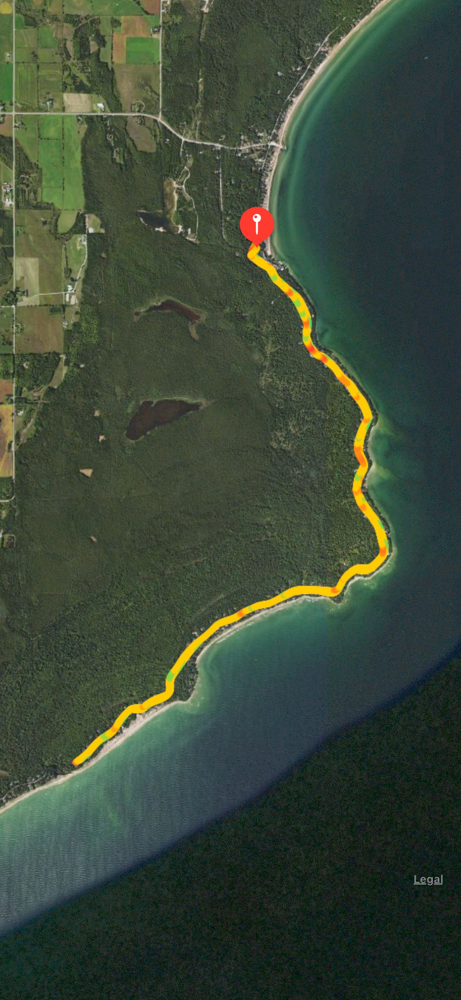
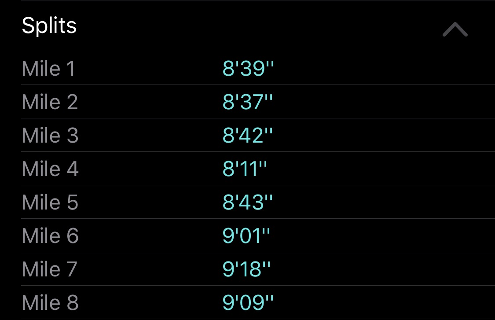
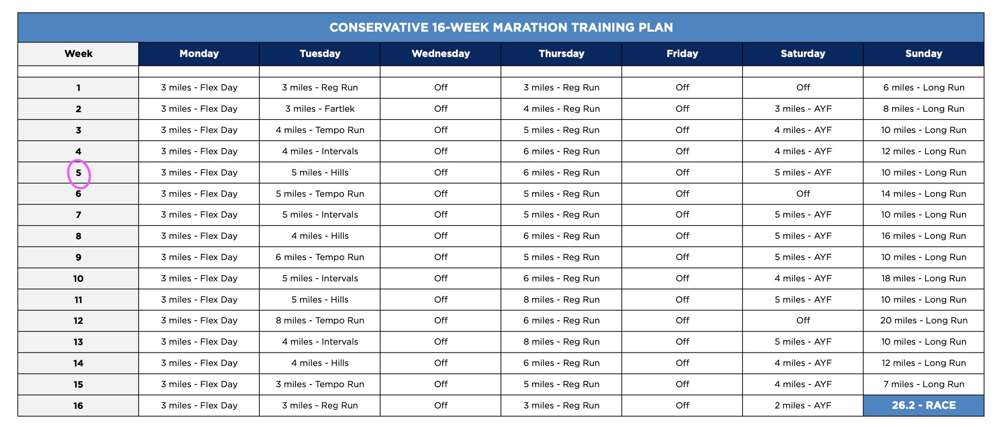

So week 8 was tough. But now, in week 9, we have a plan from our charity that's reassuring and fun:

> While this year’s marathon is canceled, you can still make every mile count for the kids with the 262 Mile Tag Team Relay!
>
> From October 1 through 31, you and a teammate can challenge each other to run 262 miles combined (about 4 miles a day!), all for the kids.
>
> Runners will also be encouraged to fundraise \$262 in support of Lurie Children’s area of greatest need, support that is needed now more than ever due to COVID-19’s impact on healthcare for kids this year.

I challenged my lovely wife who's also running. When we know more about this donation, I will let you know. Also, in the meantime, any donations for this year will be applied to next year's deferral.

## Door County Training

So we have been lucky enough to stay at my aunt and uncle's lakehouse. It's been gorgeous weather. Also have spent some good family time with my cousins. Running together has been a real joy. Also, one run with my cousin pushing the pace really helped move me forward (see Wednesday).

| Day | Distance | Pace  |
| --- | -------- | ----- |
| M   | 3 mi     | 9'45" |
| T   | rest     |       |
| W   | 6 mi     | 8'33" |
| Th  | rest     |       |
| F   | rest     |       |
| Sa  | 8 mi     | 8'47" |
| Su  | rest     |       |

My long run on Saturday was one of the most fun and pretty courses I've ran in a long time (probably since the New Zealand Fox Glacier trail). It was fairly flat, few cars, tree cover, no mask, good paved roads.

My pace felt good, especially early. I slowed down, wanting to stick closer to my initially-set target pace of 9'30" for a long run.

## Next Week

Continuing at the lakehouse, amazing views ahead. But sadly we're working, still remotely. I guess without the pandemic we might not be able to be remote. Also, the trip may not have happened since Glastonbury was cancelled (sorry, side-note).

Anyway, I want to post my plan and week ahead for accountability similar to before. Also, I need to get back into the healthy habits of stretching and strengthening (forgot roller).

| Day | Distance | Pace | Target |
| --- | -------- | ---- | ------ |
| M   | 3 mi     |      | 8'50"  |
| T   | 5 mi     |      | 9'00"  |
| W   | rest     |      |        |
| Th  | 6 mi     |      | 8'45"  |
| F   | rest     |      |        |
| Sa  | 5 mi     |      | 9'30"  |
| Su  | 10 mi    |      | 9'30"  |

We're also planning on running a virtual marathon on the same day October 15.
